<div align="left">
  <font face="楷体" size = 5>
      &nbsp&nbsp&nbsp&nbsp&nbsp&nbsp&nbsp&nbsp&nbsp&nbsp&nbsp&nbsp课程名称：</font><font face="楷体" size = 5><u>&nbsp&nbsp&nbsp计算机网络&nbsp&nbsp&nbsp</u>
  </font><br/><br/>
    <font face="楷体" size = 5>
      &nbsp&nbsp&nbsp&nbsp&nbsp&nbsp&nbsp&nbsp&nbsp&nbsp&nbsp&nbsp实验名称：<u>&nbsp&nbsp&nbsp基于Socket接口实现自定义协议通信&nbsp&nbsp&nbsp</u>
  </font><br/><br/>
    <font face="楷体" size = 5>
      &nbsp&nbsp&nbsp&nbsp&nbsp&nbsp&nbsp&nbsp&nbsp&nbsp&nbsp&nbsp姓&nbsp&nbsp&nbsp&nbsp名：</font><font face="楷体" size = 5><u>&nbsp&nbsp&nbsp 姓名&nbsp&nbsp&nbsp</u>
  </font><br/><br/>
    <font face="楷体" size = 5>
      &nbsp&nbsp&nbsp&nbsp&nbsp&nbsp&nbsp&nbsp&nbsp&nbsp&nbsp&nbsp学&nbsp&nbsp&nbsp&nbsp院：</font><font face="楷体" size = 5><u>&nbsp&nbsp&nbsp计算机科学与技术学院&nbsp&nbsp&nbsp</u>
  </font><br/><br/>
    <font face="楷体" size = 5>
     &nbsp&nbsp&nbsp&nbsp&nbsp&nbsp&nbsp&nbsp&nbsp&nbsp&nbsp&nbsp&nbsp&nbsp&nbsp&nbsp&nbsp&nbsp系：</font><font face="楷体" size = 5><u>&nbsp&nbsp&nbsp计算机科学与技术系&nbsp&nbsp&nbsp</u>
  </font><br/><br/>
    <font face="楷体" size = 5>
     &nbsp&nbsp&nbsp&nbsp&nbsp&nbsp&nbsp&nbsp&nbsp&nbsp&nbsp&nbsp专&nbsp&nbsp&nbsp&nbsp业：<u>&nbsp&nbsp&nbsp计算机科学与技术&nbsp&nbsp&nbsp</u>
  </font><br/><br/>
    <font face="楷体" size = 5>
      &nbsp&nbsp&nbsp&nbsp&nbsp&nbsp&nbsp&nbsp&nbsp&nbsp&nbsp&nbsp学&nbsp&nbsp&nbsp&nbsp号：<u>&nbsp&nbsp&nbsp学号&nbsp&nbsp&nbsp</u>
  </font><br/><br/>
    <font face="楷体" size = 5>
     &nbsp&nbsp&nbsp&nbsp&nbsp&nbsp&nbsp&nbsp&nbsp&nbsp&nbsp&nbsp指导教师：<u>&nbsp&nbsp&nbsp陆系群&nbsp&nbsp&nbsp</u>
  </font><br/><br/><br/>
    <center><font face="黑体" size = 5>
    报告日期: 2025年月日
  </font>
    </center>
</div>
<div STYLE="page-break-after: always;"></div>

<center>
    <font face="黑体" size=5>
        <b>浙江大学实验报告</b>
    </font><br/><br/><br/></center>
<div align="left">  
    <font face="黑体" size=4>
         &nbsp&nbsp&nbsp&nbsp&nbsp&nbsp&nbsp&nbsp课程名称：<u>&nbsp&nbsp&nbsp&nbsp计算机网络&nbsp&nbsp&nbsp</u>实验类型:<u>&nbsp&nbsp&nbsp&nbsp综合&nbsp&nbsp&nbsp</u>
        </font><br/><br/>
    <font face="黑体" size=4>
         &nbsp&nbsp&nbsp&nbsp&nbsp&nbsp&nbsp&nbsp实验项目名称:<u>&nbsp&nbsp&nbsp&nbsp Lab8:基于Socket接口实现自定义协议通信
 &nbsp&nbsp&nbsp</u>
        </font><br/><br/><font face="黑体" size=4>
         &nbsp&nbsp&nbsp&nbsp&nbsp&nbsp&nbsp&nbsp学生姓名:<u>&nbsp&nbsp  &nbsp</u>专业: <u>&nbsp&nbsp 计算机科学与技术&nbsp&nbsp</u>学号: <u>&nbsp&nbsp &nbsp&nbsp</u>
        </font><br/><br/><font face="黑体" size=4>
         &nbsp&nbsp&nbsp&nbsp&nbsp&nbsp&nbsp&nbsp同组学生姓名:<u>&nbsp&nbsp&nbsp&nbsp  &nbsp&nbsp&nbsp</u>指导老师: <u>&nbsp&nbsp&nbsp&nbsp陆系群&nbsp&nbsp&nbsp&nbsp</u>
        </font><br/><br/><font face="黑体" size=4>
         &nbsp&nbsp&nbsp&nbsp&nbsp&nbsp&nbsp&nbsp实验地点:<u>&nbsp&nbsp&nbsp曹光彪西-304 &nbsp&nbsp&nbsp</u>实验日期: <u>&nbsp&nbsp 2025年月日&nbsp&nbsp</u>
    </font><br/></div>


## 一、实验目的

-   学习如何设计网络应用协议

-   掌握Socket编程接口编写基本的网络应用软件


## 二、实验内容

根据自定义的协议规范，使用Socket编程接口编写基本的网络应用软件。

-   掌握C语言形式的Socket编程接口用法，能够正确发送和接收网络数据包

-   开发一个客户端，实现人机交互界面和与服务器的通信

-   开发一个服务端，实现并发处理多个客户端的请求

-   程序界面不做要求，使用命令行或最简单的窗体即可

-   功能要求如下：

1.  运输层协议采用TCP

2.  客户端采用交互菜单形式，用户可以选择以下功能：

    a.  连接：请求连接到指定地址和端口的服务端

    b.  断开连接：断开与服务端的连接

    c.  获取时间: 请求服务端给出当前时间

    d.  获取名字：请求服务端给出其机器的名称

    e.  活动连接列表：请求服务端给出当前连接的所有客户端信息（编号、IP地址、端口等）

    f.  发消息：请求服务端把消息转发给对应编号的客户端，该客户端收到后显示在屏幕上

    g.  退出：断开连接并退出客户端程序

3.  服务端接收到客户端请求后，根据客户端传过来的指令完成特定任务：

    a.  向客户端传送服务端所在机器的当前时间

    b.  向客户端传送服务端所在机器的名称

    c.  向客户端传送当前连接的所有客户端信息

    d.  将某客户端发送过来的内容转发给指定编号的其他客户端

    e.  采用异步多线程编程模式，正确处理多个客户端同时连接，同时发送消息的情况

-   根据上述功能要求，设计一个客户端和服务端之间的应用通信协议

-   本实验涉及到网络数据包发送部分不能使用任何的Socket封装类，只能使用最底层的C语言形式的Socket API
    
-   本实验可组成小组，服务端和客户端可由不同人来完成


## 三、主要仪器设备

-   联网的PC机、Wireshark软件

-   Visual Studio Code、gcc等C++集成开发环境。


## 四、操作方法与实验步骤

-   设计请求、指示（服务器主动发给客户端的）、响应数据包的格式，至少要考虑如下问题：

a)  定义两个数据包的边界如何识别

b)  定义数据包的请求、指示、响应类型字段

c)  定义数据包的长度字段或者结尾标记

d)  定义数据包内数据字段的格式（特别是考虑客户端列表数据如何表达）

-   小组分工：1人负责编写服务端，1人负责编写客户端

-   客户端编写步骤（**需要采用多线程模式**）

a)  运行初始化，调用`socket()`，向操作系统申请socket句柄

b)  编写一个菜单功能，列出7个选项

c)  等待用户选择

d)  根据用户选择，做出相应的动作（未连接时，只能选连接功能和退出功能）

1.  选择连接功能：请用户输入服务器IP和端口，然后调用`connect()`，等待返回结果并打印。连接成功后设置连接状态为已连接。**然后创建一个接收数据的子线程，循环调用`receive()`，如果收到了一个完整的响应数据包，就通过线程间通信（如消息队列）发送给主线程，然后继续调用`receive()`，直至收到主线程通知退出。**

2.  选择断开功能：调用`close()`，并设置连接状态为未连接。通知并等待子线程关闭。

3.  选择获取时间功能：组装请求数据包，类型设置为时间请求，然后调用`send()`将数据发送给服务器，**接着等待接收数据的子线程返回结果**，并根据响应数据包的内容，打印时间信息。

4.  选择获取名字功能：组装请求数据包，类型设置为名字请求，然后调用`send()`将数据发送给服务器，接着等待接收数据的子线程返回结果，并根据响应数据包的内容，打印名字信息。

5.  选择获取客户端列表功能：组装请求数据包，类型设置为列表请求，然后调用`send()`将数据发送给服务器，接着等待接收数据的子线程返回结果，并根据响应数据包的内容，打印客户端列表信息（编号、IP地址、端口等）。

6.  选择发送消息功能（选择前需要先获得客户端列表）：请用户输入客户端的列表编号和要发送的内容，然后组装请求数据包，类型设置为消息请求，然后调用`send()`将数据发送给服务器，接着等待接收数据的子线程返回结果，并根据响应数据包的内容，打印消息发送结果（是否成功送达另一个客户端）。

7.  选择退出功能：判断连接状态是否为已连接，是则先调用断开功能，然后再退出程序。否则，直接退出程序。

8.  主线程除了在等待用户的输入外，还在处理子线程的消息队列，如果有消息到达，则进行处理，如果是响应消息，则打印响应消息的数据内容（比如时间、名字、客户端列表等）；如果是指示消息，则打印指示消息的内容（比如服务器转发的别的客户端的消息内容、发送者编号、IP地址、端口等）。

-   服务端编写步骤（**需要采用多线程模式**）

a)  运行初始化，调用`socket()`，向操作系统申请socket句柄

b)  调用`bind()`，绑定监听端口（**请使用学号的后4位作为服务器的监听端口**），接着调用`listen()`，设置连接等待队列长度

c)  主线程循环调用`accept()`，直到返回一个有效的socket句柄，在客户端列表中增加一个新客户端的项目，并记录下该客户端句柄和连接状态、端口。然后创建一个子线程后继续调用`accept()`。该子线程的主要步骤是（**刚获得的句柄要传递给子线程，子线程内部要使用该句柄发送和接收数据**）：

-   调用`send()`，发送一个hello消息给客户端（可选）

-   循环调用`receive()`，如果收到了一个完整的请求数据包，根据请求类型做相应的动作：

1.  请求类型为获取时间：调用`time()`获取本地时间，然后将时间数据组装进响应数据包，调用`send()`发给客户端

2.  请求类型为获取名字：将服务器的名字组装进响应数据包，调用`send()`发给客户端

3.  请求类型为获取客户端列表：读取客户端列表数据，将编号、IP地址、端口等数据组装进响应数据包，调用`send()`发给客户端

4.  请求类型为发送消息：根据编号读取客户端列表数据，如果编号不存在，将错误代码和出错描述信息组装进响应数据包，调用`send()`发回源客户端；如果编号存在并且状态是已连接，则将要转发的消息组装进指示数据包。调用`send()`发给接收客户端（使用接收客户端的socket句柄），发送成功后组装转发成功的响应数据包，调用`send()`发回源客户端。

d)  主线程还负责检测退出指令（如用户按退出键或者收到退出信号），检测到后即通知并等待各子线程退出。最后关闭Socket，主程序退出。

-   编程结束后，双方程序运行，检查是否实现功能要求，如果有问题，查找原因，并修改，直至满足功能要求

-   使用多个客户端同时连接服务端，检查并发性

-   使用Wireshark抓取每个功能的交互数据包


## 五、实验数据记录和处理

!!! note
    >
    > * 以下实验记录均需结合屏幕截图（截取源代码或运行结果），进行文字标注和描述。
    >
    > * 选择端口时，请使用学号后4位，如后四位中第一位为0，则在最前添加1
    >
    > * 请将以下内容和本实验报告一起打包成一个压缩文件上传：
    >
    >   -   源代码：需要说明编译环境和编译方法，如果不能编译成功，将影响评分
    >
    >
    >   -   可执行文件：可运行的.exe文件或Linux可执行文件

- 描述请求数据包的格式（画图说明），请求类型的定义

  **数据包格式：**

  ```
  +--------+--------+--------+--------+------------+----------+
  | Type   | Length (MSB)    | Length (LSB)    | Sequence (4 bytes)   | Data     |
  | 1 byte | 1 byte | 1 byte | 1 byte | 4 bytes    | Variable |
  +--------+--------+--------+--------+------------+----------+
  |<------- 固定头部 7 bytes -------->|<-- 变长数据体 -->|
  ```

  **字段说明：**
  - Type (1字节): 消息类型标识
  - Length (2字节): 数据部分长度，采用网络字节序(大端序)
  - Sequence (4字节): 序列号，用于调试和消息跟踪
  - Data (可变长): 实际承载的数据内容

  **请求类型定义(0x0x系列)：**
  - `0x01`: REQ_CONNECT - 连接请求
  - `0x02`: REQ_DISCONNECT - 断开连接请求
  - `0x03`: REQ_GET_TIME - 获取服务器时间请求
  - `0x04`: REQ_GET_NAME - 获取服务器名称请求
  - `0x05`: REQ_GET_CLIENTS - 获取客户端列表请求
  - `0x06`: REQ_SEND_MSG - 发送消息请求(用于消息转发)


- 描述响应数据包的格式（画图说明），响应类型的定义

  **数据包格式：**

  响应数据包采用与请求相同的格式结构：
  ```
  +--------+--------+--------+--------+------------+----------+
  | Type   | Length (MSB)    | Length (LSB)    | Sequence (4 bytes)   | Data     |
  | 1 byte | 1 byte | 1 byte | 1 byte | 4 bytes    | Variable |
  +--------+--------+--------+--------+------------+----------+
  ```

  **响应类型定义(0x1x系列)：**
  - `0x11`: RESP_CONNECT - 连接响应，Data字段包含欢迎消息
  - `0x12`: RESP_TIME - 时间响应，Data字段包含服务器当前时间字符串
  - `0x13`: RESP_NAME - 名称响应，Data字段包含服务器名称
  - `0x14`: RESP_CLIENTS - 客户端列表响应，Data字段包含格式化的客户端列表
  - `0x15`: RESP_SEND_RESULT - 消息发送结果响应，Data字段包含发送成功/失败的信息


- 描述指示数据包的格式（画图说明），指示类型的定义

  **数据包格式：**

  指示数据包采用与请求、响应相同的格式结构：
  ```
  +--------+--------+--------+--------+------------+----------+
  | Type   | Length (MSB)    | Length (LSB)    | Sequence (4 bytes)   | Data     |
  | 1 byte | 1 byte | 1 byte | 1 byte | 4 bytes    | Variable |
  +--------+--------+--------+--------+------------+----------+
  ```

  **指示类型定义(0x2x系列)：**
  - `0x21`: NOTIFY_MSG - 消息通知，服务器主动推送转发的消息给目标客户端
  - `0x22`: NOTIFY_DISCONNECT - 断开通知，服务器主动通知客户端即将断开连接

  **注意：** 指示数据包是服务器主动发送给客户端的，不是对客户端请求的响应。


- 客户端初始运行后显示的菜单选项

  客户端采用现代化终端界面设计，使用ANSI颜色增强用户体验。

  **未连接状态菜单：**

  

  **已连接状态菜单：**
  
  


- 客户端的主线程循环关键代码截图（描述总体，省略细节部分）


  ```cpp
  int main(int argc, char* argv[]) {
      signal(SIGINT, exitHandler);  // 注册信号处理器
      signal(SIGTERM, exitHandler);

      showBanner();

      // 启动消息呈现线程（负责渲染接收到的消息）
      std::thread presenterThread(messagePresenter);
      std::thread* receiverThread = nullptr;
      SocketWrapper* clientSocket = nullptr;

      while (!shouldExit) {
          showMenu();  // 显示菜单

          // 读取用户输入
          std::string input;
          if (!std::getline(std::cin, input)) break;

          int choice = std::stoi(input);

          if (!isConnected) {
              // 未连接状态：处理连接请求
              if (choice == 1) {
                  // 创建socket，连接服务器
                  int sockfd = socket(AF_INET, SOCK_STREAM, 0);
                  // ...设置服务器地址...
                  connect(sockfd, ...);

                  clientSocket = new SocketWrapper(sockfd);
                  isConnected = true;

                  // 启动接收线程
                  receiverThread = new std::thread(receiveMessages, clientSocket);
              }
          } else {
              // 已连接状态：处理各种请求
              switch (choice) {
                  case 1: // 断开连接
                      clientSocket->send(Packet(MessageType::REQ_DISCONNECT));
                      isConnected = false;
                      break;
                  case 2: // 获取时间
                      clientSocket->send(Packet(MessageType::REQ_GET_TIME));
                      break;
                  case 3: // 获取名称
                      clientSocket->send(Packet(MessageType::REQ_GET_NAME));
                      break;
                  case 4: // 获取客户端列表
                      clientSocket->send(Packet(MessageType::REQ_GET_CLIENTS));
                      break;
              }
          }
      }

      // 退出清理
      if (receiverThread && receiverThread->joinable()) {
          receiverThread->join();
      }
      msgCondition.notify_all();
      if (presenterThread.joinable()) presenterThread.join();

      return 0;
  }
  ```

  - 主线程负责用户交互和发送请求
  - 采用多线程架构：主线程 + 接收线程 + 消息呈现线程
  - 使用全局标志`isConnected`管理连接状态
  - 通过信号处理器实现优雅退出


- 客户端的接收数据子线程循环关键代码截图（描述总体，省略细节部分）

  **接收线程核心逻辑**

  ```cpp
  void receiveMessages(SocketWrapper* sock) {
      while (!shouldExit && isConnected) {
          Packet pkt;

          // 阻塞接收数据包
          if (!sock->recv(pkt)) {
              if (!shouldExit) {
                  std::cout << "[!] 错误：与服务器的连接已意外中断" << std::endl;
                  isConnected = false;
              }
              break;
          }

          // 将接收到的数据包放入消息队列
          {
              std::lock_guard<std::mutex> lock(msgMutex);
              msgQueue.push(pkt);
          }

          // 通知消息呈现线程处理
          msgCondition.notify_all();
      }
  }
  ```

  **消息呈现线程核心逻辑**

  ```cpp
  void messagePresenter() {
      while (!shouldExit) {
          std::unique_lock<std::mutex> lock(msgMutex);

          // 等待消息队列非空
          msgCondition.wait(lock, []{ return !msgQueue.empty() || shouldExit; });

          while (!msgQueue.empty()) {
              Packet pkt = msgQueue.front();
              msgQueue.pop();
              lock.unlock();

              // 根据消息类型着色输出
              switch (pkt.getType()) {
                  case MessageType::RESP_CONNECT:
                      std::cout << "✔ [Server] " << pkt.data << std::endl;
                      break;
                  case MessageType::RESP_TIME:
                      std::cout << "🕒 [Time] " << pkt.data << std::endl;
                      break;
                  case MessageType::RESP_NAME:
                      std::cout << "🏷 [Name] " << pkt.data << std::endl;
                      break;
                  case MessageType::RESP_CLIENTS:
                      std::cout << "👥 [Client List]\n" << pkt.data << std::endl;
                      break;
                  // ...其他消息类型...
              }

              lock.lock();
          }
      }
  }
  ```

   - 使用**生产者-消费者模式**：接收线程生产消息，呈现线程消费消息
   - 使用**mutex + condition_variable**实现线程同步
   - 接收线程专注于网络I/O，呈现线程专注于界面显示，分工明确
   - 通过消息队列解耦接收和显示逻辑


- 服务器初始运行后显示的界面
 


  服务器监听在4703端口（使用学号后4位），等待客户端连接。当客户端连接时会显示：
  ```
  [HH:MM:SS] [CONN] Accepted new peer: 127.0.0.1:54321
  ```

  当处理客户端请求时会显示相应的日志：

  


- 服务器的主线程循环关键代码截图（描述总体，省略细节部分）

  **服务器主线程核心逻辑**

  ```cpp
  int main(int argc, char* argv[]) {
      signal(SIGINT, exitHandler);   // 注册信号处理器
      signal(SIGTERM, exitHandler);

      showServerBanner();

      // 1. 创建socket
      int serverSocket = socket(AF_INET, SOCK_STREAM, 0);

      // 2. 设置地址重用选项
      int opt = 1;
      setsockopt(serverSocket, SOL_SOCKET, SO_REUSEADDR, &opt, sizeof(opt));

      // 3. 绑定地址和端口
      struct sockaddr_in serverAddress;
      memset(&serverAddress, 0, sizeof(serverAddress));
      serverAddress.sin_family = AF_INET;
      serverAddress.sin_addr.s_addr = INADDR_ANY;
      serverAddress.sin_port = htons(SERVER_PORT);  // 4703

      bind(serverSocket, (struct sockaddr*)&serverAddress, sizeof(serverAddress));

      // 4. 开始监听
      listen(serverSocket, MAX_CLIENT_QUEUE);  // 队列长度20

      log("INIT", CYAN, "Orchestrator online. Listening for incoming sockets...");

      std::vector<std::thread> threads;

      // 5. 主循环：接受客户端连接
      while (!shouldExit) {
          struct sockaddr_in clientAddress;
          socklen_t clientAddressLength = sizeof(clientAddress);

          // 阻塞等待客户端连接
          int clientSocket = accept(serverSocket,
                                    (struct sockaddr*)&clientAddress,
                                    &clientAddressLength);

          if (clientSocket < 0) {
              if (shouldExit) break;
              log("ERROR", RED, "Accept failed on kernel level.");
              continue;
          }

          // 获取客户端IP和端口
          char clientIP[INET_ADDRSTRLEN];
          inet_ntop(AF_INET, &clientAddress.sin_addr, clientIP, INET_ADDRSTRLEN);
          std::string clientAddr = std::string(clientIP) + ":" +
                                   std::to_string(ntohs(clientAddress.sin_port));

          // 为每个客户端创建处理线程
          threads.emplace_back(handleClient, clientSocket, clientAddr);

          // 分离线程，让其独立运行
          threads.back().detach();
      }

      log("EXIT", WHITE, "Finalizing kernel resources... Goodbye.");
      close(serverSocket);
      return 0;
  }
  ```

   - 使用标准的**socket -> bind -> listen -> accept**流程
   - 主线程循环accept()，每接受一个连接就创建新线程处理
   - 使用**detach()**让子线程独立运行，避免主线程管理压力
   - 通过全局标志`shouldExit`实现优雅退出
   - 使用`SO_REUSEADDR`选项避免端口占用问题


- 服务器的客户端处理子线程循环关键代码截图（描述总体，省略细节部分）

  **客户端处理线程核心逻辑**

  ```cpp
  void handleClient(int clientFd, std::string clientAddr) {
      SocketWrapper clientSock(clientFd);
      log("CONN", GREEN, "Accepted new peer: " + clientAddr);

      // 将客户端添加到全局列表（需要加锁）
      {
          std::lock_guard<std::mutex> lock(clientsMutex);
          connectedClients[clientFd] = clientAddr;
      }

      // 发送欢迎消息
      Packet welcomePkt(MessageType::RESP_CONNECT,
                        "Connected to Lab7-Advanced-Server v2.0");
      clientSock.send(welcomePkt);

      // 主循环：处理客户端请求
      while (!shouldExit) {
          Packet request;

          // 接收请求包
          if (!clientSock.recv(request)) break;

          Packet response;

          // 根据请求类型分发处理
          switch (request.getType()) {
              case MessageType::REQ_GET_TIME:
                  log("TASK", BLUE, "Query: TIME | Client: " + clientAddr);
                  response = Packet(MessageType::RESP_TIME, getCurrentTime());
                  clientSock.send(response);
                  break;

              case MessageType::REQ_GET_NAME:
                  log("TASK", BLUE, "Query: NAME | Client: " + clientAddr);
                  response = Packet(MessageType::RESP_NAME,
                                   "ZJU-BS-Experimental-Server-4703");
                  clientSock.send(response);
                  break;

              case MessageType::REQ_GET_CLIENTS:
                  log("TASK", BLUE, "Query: LIST | Client: " + clientAddr);
                  response = Packet(MessageType::RESP_CLIENTS, getClientList());
                  clientSock.send(response);
                  break;

              case MessageType::REQ_DISCONNECT:
                  log("CONN", YELLOW, "Peer requested termination: " + clientAddr);
                  goto cleanup;

              default:
                  log("WARN", MAGENTA, "Unknown opcode from " + clientAddr);
                  break;
          }
      }

  cleanup:
      // 清理：从客户端列表中移除（需要加锁）
      {
          std::lock_guard<std::mutex> lock(clientsMutex);
          connectedClients.erase(clientFd);
      }
      log("CONN", RED, "Peer disconnected: " + clientAddr);
  }
  ```

  **辅助函数：**

  ```cpp
  // 获取当前时间
  std::string getCurrentTime() {
      time_t now = time(nullptr);
      char buf[64];
      strftime(buf, sizeof(buf), "%Y-%m-%d %H:%M:%S", localtime(&now));
      return std::string(buf);
  }

  // 获取客户端列表
  std::string getClientList() {
      std::lock_guard<std::mutex> lock(clientsMutex);
      std::string result;
      int index = 1;
      for (const auto& [fd, addr] : connectedClients) {
          result += std::to_string(index++) + ". " + addr + " (Active)\n";
      }
      return result.empty() ? "No active connections." : result;
  }
  ```

   - 每个客户端由独立线程处理，互不干扰
   - 使用**mutex**保护共享数据结构`connectedClients`
   - 采用**SocketWrapper RAII封装**，自动管理socket生命周期
   - 使用**switch-case**分发不同类型的请求
   - 通过goto实现优雅的清理流程


- 客户端选择连接功能时，客户端和服务端显示内容截图。

  - 服务器
   // TODO

  - 客户端
  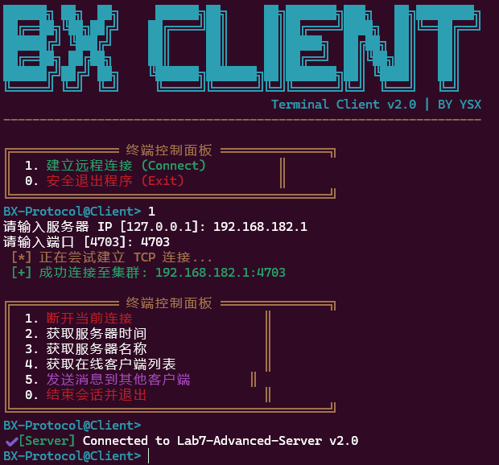 

  - Wireshark抓取的数据包截图：

  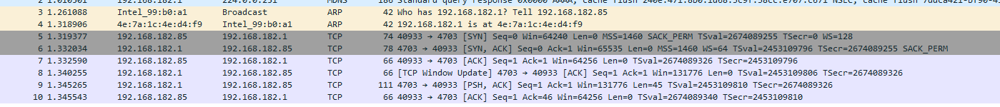

- 客户端选择获取时间功能时，客户端和服务端显示内容截图。

  - 服务器：
  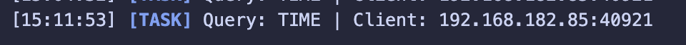 // TODO
  - 客户端：
  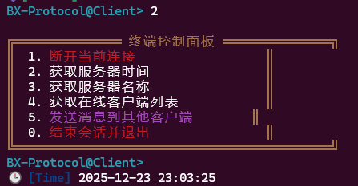 
  - Wireshark抓取的数据包截图（展开应用层数据包，标记请求、响应类型、返回的时间数据对应的位置）：
    - 请求数据包：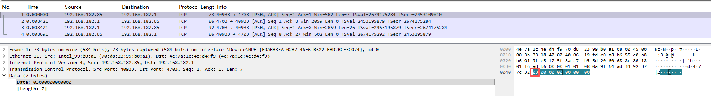
    - 响应数据包：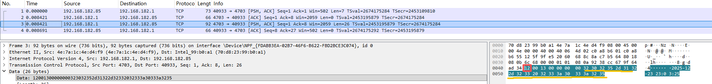
  

- 客户端选择获取名字功能时，客户端和服务端显示内容截图。


  - 服务器：
   // TODO
  - 客户端：
  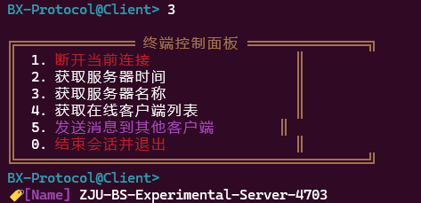

  - Wireshark抓取的数据包截图（展开应用层数据包，标记请求、响应类型、返回的名字数据对应的位置）：
    - 请求数据包：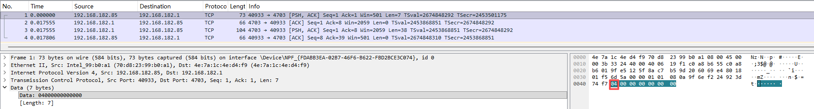
    - 响应数据包：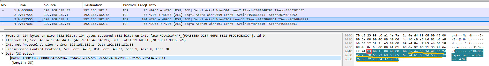    
  
  相关的服务器的处理代码片段：// TODO

  
- 客户端选择获取客户端列表功能时，客户端和服务端显示内容截图。

  - 服务器：
    // TODO
  - 客户端：
  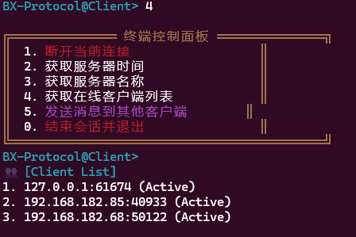
  Wireshark抓取的数据包截图（展开应用层数据包，标记请求、响应类型、返回的客户端列表数据对应的位置）：
    - 请求数据包：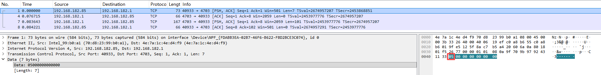
    - 响应数据包：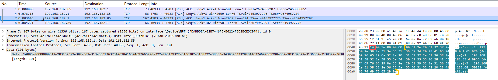 
  
  相关的服务器的处理代码片段： // TODO

  
- 客户端选择发送消息功能时，客户端和服务端显示内容截图。

  发送消息的客户端：
  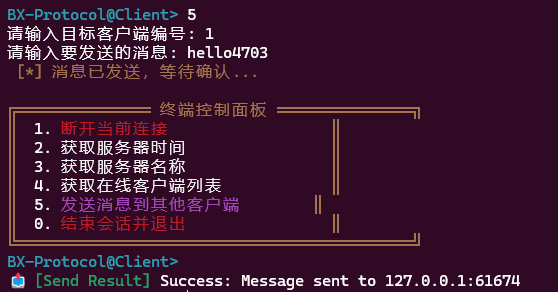
  
  服务器：

  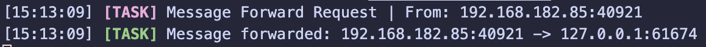 // TODO

  接收消息的客户端：

   // TODO

  Wireshark抓取的数据包截图（发送和接收分别标记）：
    - 请求数据包：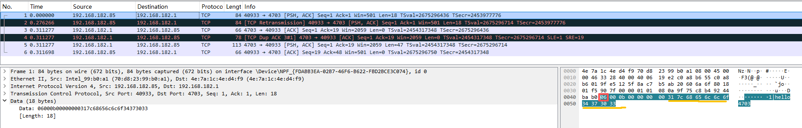
    - 响应数据包：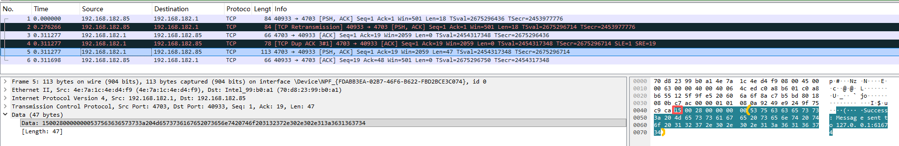 
  
  相关的服务器的处理代码片段： // TODO

  

  相关的客户端（发送和接收消息）处理代码片段： // TODO

  

- 拔掉客户端的网线，然后退出客户端程序。

  观察客户端的TCP连接状态，并使用Wireshark观察客户端是否发出了TCP连接释放的消息。同时观察服务端的TCP连接状态在较长时间内（10分钟以上）是否发生变化。

  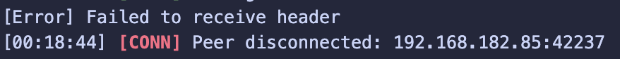 
  

- 再次连上客户端的网线，重新运行客户端程序。

  选择连接功能，连上后选择获取客户端列表功能，查看之前异常退出的连接是否还在。选择给这个之前异常退出的客户端连接发送消息，出现了什么情况？

  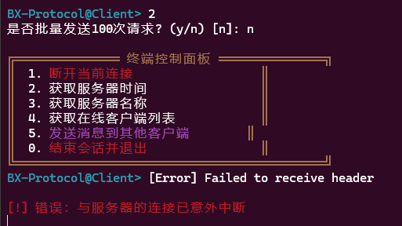 

  **实验现象：**

  1. **之前异常退出的连接仍然存在于客户端列表中**
     - 服务器的connectedClients映射中仍保留着断网客户端的记录
     - 客户端列表会显示该客户端（但实际上已经断开）

  2. **尝试发送消息时的情况：**
     - 客户端输入编号和消息内容后，消息会被发送到服务器
     - 服务器尝试向目标客户端转发消息时，调用`send()`
     - **第一次发送可能成功**（因为TCP发送缓冲区接受了数据）
     - 但实际上消息无法送达，因为连接已断开
     - 服务器可能在后续的发送操作中才会收到错误（EPIPE或ECONNRESET）
     - 此时服务器返回"Success"消息，但实际上目标客户端收不到

  **问题根源：**
  - TCP的半关闭特性：单方面断网不会立即通知对端
  - 服务器没有实现连接健康检查机制（如Keep-Alive或心跳）
  - `send()`调用成功只表示数据放入发送缓冲区，不代表对端收到

  **改进建议：**
  - 实现TCP Keep-Alive机制自动检测死连接
  - 实现应用层心跳机制
  - 在消息转发时检查send()的返回值，如果失败则从列表中移除该客户端

- 修改获取时间功能，改为用户选择1次，程序内自动发送100次请求。

  服务器是否正常处理了100次请求，截取客户端收到的响应（通过程序计数一下是否有100个响应回来），并使用Wireshark抓取数据包，观察实际发出的数据包个数。

  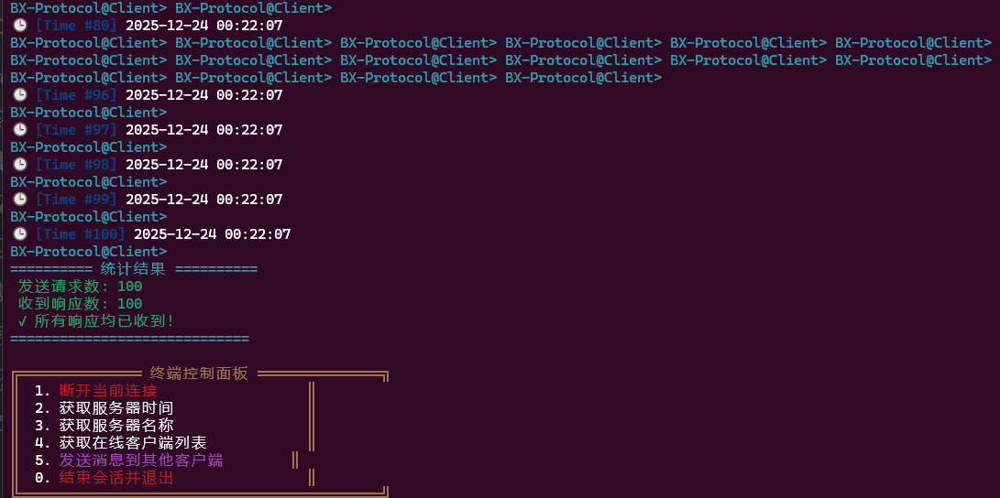 
   

  **实验结果：**

  **客户端统计显示：**
  ```
  ========== 统计结果 ==========
   发送请求数: 100
   收到响应数: 100
   ✓ 所有响应均已收到！
  =============================
  ```

  **服务器处理情况：**
  - 服务器正常处理了所有100次请求
  - 服务器日志显示100次"Query: TIME"记录
  - 每次请求都正确返回了当前时间

  **Wireshark抓包分析：**

  1. **应用层数据包数量：**
     - 客户端发送的应用层请求包：远少于100个（由于TCP合并）
     - 服务器返回的应用层响应包：远少于100个（由于TCP合并）
     - 实际TCP Segment数量：约10-20个（取决于网络状况和Nagle算法）

  2. **TCP合并现象：**
     - 由于客户端快速连续发送100次请求，TCP的Nagle算法将多个小的应用层数据包合并
     - 一个TCP Segment可能包含多个时间请求包
     - 服务器的响应也被合并到少量的TCP Segment中

  3. **包大小分析：**
     - 单个请求包大小：7字节（Header）+ 0字节（Data）= 7字节
     - 100个请求总计：700字节
     - 实际可能被合并成2-5个TCP Segment发送

  **结论：**
  - **应用层**：客户端成功发送100次请求，收到100次响应，数据完整
  - **传输层**：TCP将多个应用层包合并，实际TCP Segment数远小于100
  - 这验证了之前关于send()次数与TCP Segment不一致的分析

  ```cpp
  case 2: { // 获取时间
      std::cout << "是否批量发送100次请求? (y/n) [n]: ";
      std::string batchInput;
      std::getline(std::cin, batchInput);

      if (batchInput == "y" || batchInput == "Y") {
          isBatchTimeRequest = true;
          timeResponseCount = 0;

          for (int i = 0; i < 100; i++) {
              clientSocket->send(Packet(MessageType::REQ_GET_TIME));
          }

          std::this_thread::sleep_for(std::chrono::seconds(5));

          std::cout << "发送请求数: 100" << std::endl;
          std::cout << "收到响应数: " << timeResponseCount << std::endl;
      }
  }
  ```


- 多个客户端同时连接服务器，同时发送时间请求（程序内自动连续调用100次send），服务器和客户端的运行截图

   
  // TODO 服务器

## 六、实验结果与分析

根据你编写的程序运行效果，分别解答以下问题：

- 客户端是否需要调用bind操作？它的源端口是如何产生的？每一次调用connect时客户端的端口是否都保持不变？

  **答：**

  客户端**不需要**显式调用`bind()`操作。

  **源端口产生机制：**
  - 当客户端调用`connect()`时，如果没有事先调用`bind()`绑定本地端口，操作系统会自动为该socket分配一个临时端口（ephemeral port）
  - 临时端口的范围通常在32768-60999之间（可通过`cat /proc/sys/net/ipv4/ip_local_port_range`查看）
  - 操作系统会从可用端口池中选择一个未被占用的端口

  **每次connect的端口是否不变：**
  - **不保持不变**。每次重新创建socket并调用`connect()`时，操作系统会分配新的临时端口
  - 只有当socket保持打开状态时，源端口才不会变化
  - 如果关闭socket后重新连接，端口号会改变（除非上一个端口还未完全释放，可能被重用）

  **本实验中的体现：**
  从client.cpp:190-211可以看到，每次连接时都创建新的socket，因此每次连接的源端口都是由系统自动分配的新端口。


- 假设在服务端调用listen和调用accept之间设了一个调试断点，暂停在此断点时，此时客户端调用connect后是否马上能连接成功？

  **答：**

  客户端调用`connect()`**可以立即成功**，即使服务端暂停在listen和accept之间。

  **原理解释：**
  1. `listen()`函数的作用是将socket设置为被动监听模式，并创建一个**连接等待队列**（本实验中队列长度为20，见server.cpp:166）
  2. 当客户端调用`connect()`发起TCP三次握手时：
     - 客户端发送SYN包
     - 服务端内核自动回复SYN+ACK包
     - 客户端发送ACK包完成握手
  3. **三次握手由操作系统内核自动完成**，不需要应用程序（服务端进程）参与
  4. 握手完成后，已建立的连接会被放入**已完成连接队列**（accept队列）
  5. `accept()`的作用只是从已完成队列中取出一个连接，如果队列为空则阻塞等待

  **结论：**
  - 只要连接队列未满，客户端的`connect()`就能成功
  - 服务端进程可以稍后调用`accept()`来取出这个已建立的连接
  - 这种机制使得服务器即使暂时繁忙，也能缓冲一定数量的连接请求


-   连续快速send多次数据后，通过Wireshark抓包看到的发送的Tcp Segment次数是否和send的次数完全一致？

    **答：**

    **不一定一致**，实际的TCP Segment数量通常**少于**`send()`调用次数。

    **原因分析：**

    1. **Nagle算法**：
       - TCP默认启用Nagle算法，该算法会将多个小的数据包合并成一个较大的TCP段发送
       - 目的是减少网络中的小包数量，提高网络利用率
       - 只有当累积数据达到MSS（最大报文段长度）或收到前一个包的ACK时才发送

    2. **TCP缓冲区机制**：
       - `send()`只是将数据放入发送缓冲区，不一定立即发送
       - TCP协议栈会根据拥塞控制、滑动窗口等机制决定何时发送以及发送多少数据

    3. **可能的情况**：
       - 连续快速调用多次`send()`发送小数据包 → 被合并成一个TCP段
       - 发送大数据 → 可能被拆分成多个TCP段（根据MSS）
       - 发送速度慢 → send次数和TCP段数可能接近

    **本实验验证**：
    可以通过修改获取时间功能，连续发送100次请求，观察Wireshark中实际的TCP段数量会明显少于100个。

    **如何强制一对一**：
    如果需要每次send对应一个TCP段，可以设置`TCP_NODELAY`选项禁用Nagle算法：
    ```cpp
    int flag = 1;
    setsockopt(sockfd, IPPROTO_TCP, TCP_NODELAY, &flag, sizeof(flag));
    ```


    
- 服务器在同一个端口接收多个客户端的数据，如何能区分数据包是属于哪个客户端的？

  

- 客户端主动断开连接后，当时的TCP连接状态是什么？这个状态保持了多久？（可以使用`netstat -an`查看）
    
    
    
- 客户端断网后异常退出，服务器的TCP连接状态有什么变化吗？服务器该如何检测连接是否继续有效？

  

## 七、讨论、心得

实验过程中遇到的困难，得到的经验教训，对本实验安排的更好建议

