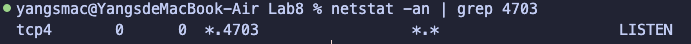
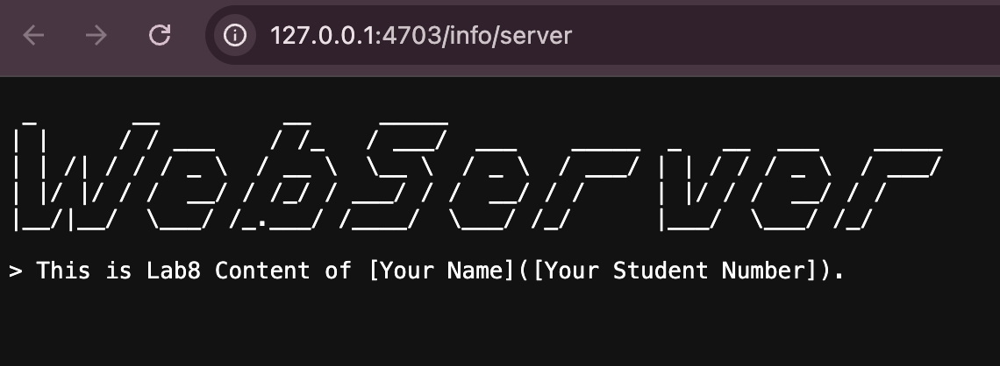
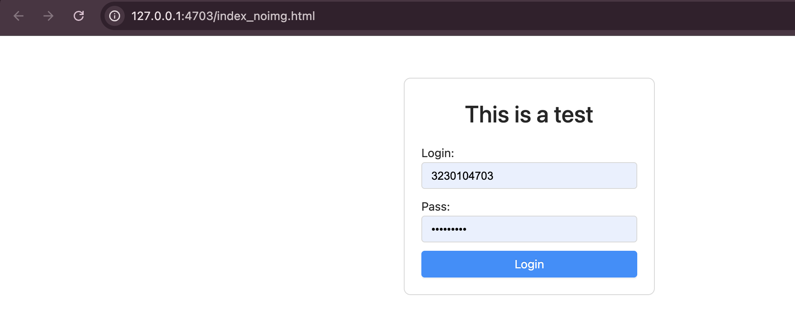
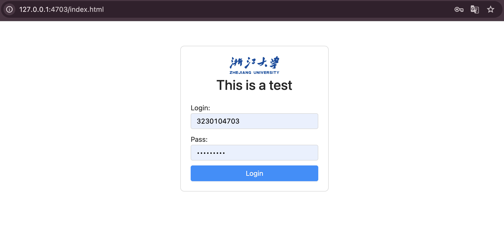
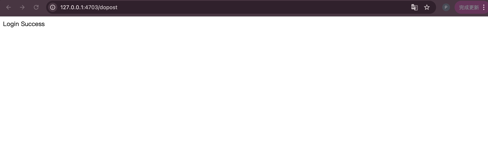
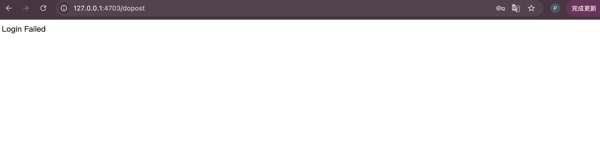
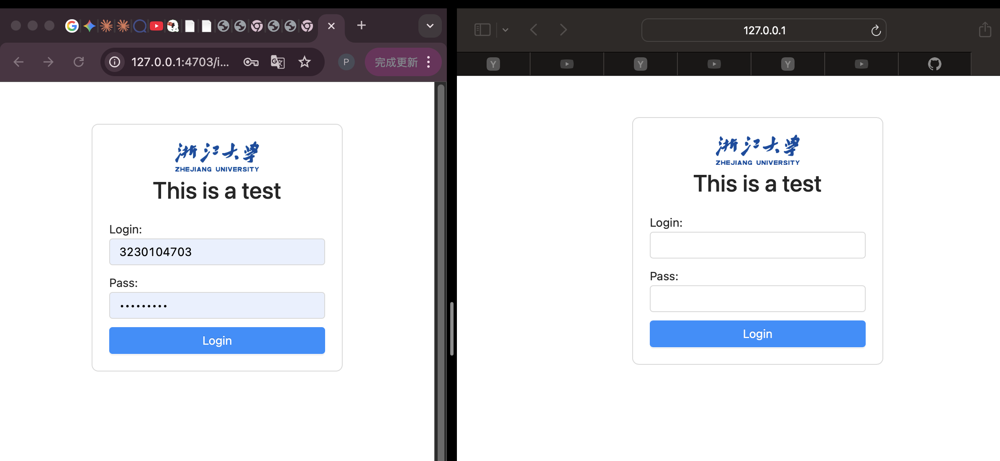
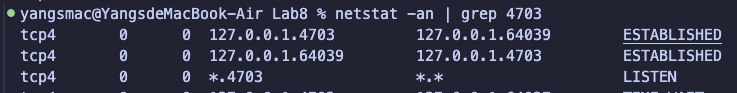

<div align="left">
  <font face="楷体" size = 5>
      &nbsp&nbsp&nbsp&nbsp&nbsp&nbsp&nbsp&nbsp&nbsp&nbsp&nbsp&nbsp课程名称：</font><font face="楷体" size = 5><u>&nbsp&nbsp&nbsp计算机网络&nbsp&nbsp&nbsp</u>
  </font><br/><br/>
    <font face="楷体" size = 5>
      &nbsp&nbsp&nbsp&nbsp&nbsp&nbsp&nbsp&nbsp&nbsp&nbsp&nbsp&nbsp实验名称：<u>&nbsp&nbsp&nbsp实现一个轻量级的WEB服务器&nbsp&nbsp&nbsp</u>
  </font><br/><br/>
    <font face="楷体" size = 5>
      &nbsp&nbsp&nbsp&nbsp&nbsp&nbsp&nbsp&nbsp&nbsp&nbsp&nbsp&nbsp姓&nbsp&nbsp&nbsp&nbsp名：</font><font face="楷体" size = 5><u>&nbsp&nbsp&nbsp 姓名&nbsp&nbsp&nbsp</u>
  </font><br/><br/>
    <font face="楷体" size = 5>
      &nbsp&nbsp&nbsp&nbsp&nbsp&nbsp&nbsp&nbsp&nbsp&nbsp&nbsp&nbsp学&nbsp&nbsp&nbsp&nbsp院：</font><font face="楷体" size = 5><u>&nbsp&nbsp&nbsp计算机科学与技术学院&nbsp&nbsp&nbsp</u>
  </font><br/><br/>
    <font face="楷体" size = 5>
     &nbsp&nbsp&nbsp&nbsp&nbsp&nbsp&nbsp&nbsp&nbsp&nbsp&nbsp&nbsp&nbsp&nbsp&nbsp&nbsp&nbsp&nbsp系：</font><font face="楷体" size = 5><u>&nbsp&nbsp&nbsp计算机科学与技术系&nbsp&nbsp&nbsp</u>
  </font><br/><br/>
    <font face="楷体" size = 5>
     &nbsp&nbsp&nbsp&nbsp&nbsp&nbsp&nbsp&nbsp&nbsp&nbsp&nbsp&nbsp专&nbsp&nbsp&nbsp&nbsp业：<u>&nbsp&nbsp&nbsp计算机科学与技术&nbsp&nbsp&nbsp</u>
  </font><br/><br/>
    <font face="楷体" size = 5>
      &nbsp&nbsp&nbsp&nbsp&nbsp&nbsp&nbsp&nbsp&nbsp&nbsp&nbsp&nbsp学&nbsp&nbsp&nbsp&nbsp号：<u>&nbsp&nbsp&nbsp学号&nbsp&nbsp&nbsp</u>
  </font><br/><br/>
    <font face="楷体" size = 5>
     &nbsp&nbsp&nbsp&nbsp&nbsp&nbsp&nbsp&nbsp&nbsp&nbsp&nbsp&nbsp指导教师：<u>&nbsp&nbsp&nbsp陆系群&nbsp&nbsp&nbsp</u>
  </font><br/><br/><br/>
    <center><font face="黑体" size = 5>
    报告日期: 2025年月日
  </font>
</center>
</div>
<div STYLE="page-break-after: always;"></div>

<center>
    <font face="黑体" size=5>
        <b>浙江大学实验报告</b>
    </font><br/><br/><br/></center>
<div align="left"> 
    <font face="黑体" size=4>
         &nbsp&nbsp&nbsp&nbsp&nbsp&nbsp&nbsp&nbsp课程名称：<u>&nbsp&nbsp&nbsp&nbsp计算机网络&nbsp&nbsp&nbsp</u>实验类型:<u>&nbsp&nbsp&nbsp&nbsp综合&nbsp&nbsp&nbsp</u>
        </font><br/><br/>
    <font face="黑体" size=4>
         &nbsp&nbsp&nbsp&nbsp&nbsp&nbsp&nbsp&nbsp实验项目名称:<u>&nbsp&nbsp&nbsp&nbsp Lab8:实现一个轻量级的WEB服务器
 &nbsp&nbsp&nbsp</u>
        </font><br/><br/><font face="黑体" size=4>
         &nbsp&nbsp&nbsp&nbsp&nbsp&nbsp&nbsp&nbsp学生姓名:<u>&nbsp&nbsp  &nbsp</u>专业: <u>&nbsp&nbsp 计算机科学与技术&nbsp&nbsp</u>学号: <u>&nbsp&nbsp &nbsp&nbsp</u>
        </font><br/><br/><font face="黑体" size=4>
         &nbsp&nbsp&nbsp&nbsp&nbsp&nbsp&nbsp&nbsp同组学生姓名:<u>&nbsp&nbsp&nbsp&nbsp  &nbsp&nbsp&nbsp</u>指导老师: <u>&nbsp&nbsp&nbsp&nbsp陆系群&nbsp&nbsp&nbsp&nbsp</u>
        </font><br/><br/><font face="黑体" size=4>
         &nbsp&nbsp&nbsp&nbsp&nbsp&nbsp&nbsp&nbsp实验地点:<u>&nbsp&nbsp&nbsp曹光彪西-304 &nbsp&nbsp&nbsp</u>实验日期: <u>&nbsp&nbsp 2025年月日&nbsp&nbsp</u>
    </font><br/></div>


## 一、实验目的

深入掌握HTTP协议规范，学习如何编写标准的互联网应用服务器。


## 二、实验内容

-   服务程序能够正确解析HTTP协议，并传回所需的网页文件和图片文件

-   使用标准的浏览器，如Chrome或者Safari，输入服务程序的URL后，能够正常显示服务器上的网页文件和图片

-   服务端程序界面不做要求，使用命令行或最简单的窗体即可

-   功能要求如下：

1.  服务程序运行后监听在80端口或者指定端口

2.  接受浏览器的TCP连接（支持多个浏览器同时连接）

3.  读取浏览器发送的数据，解析HTTP请求头部，找到感兴趣的部分

4.  根据HTTP头部请求的文件路径，打开并读取服务器磁盘上的文件，以HTTP响应格式传回浏览器。要求按照文本、图片文件传送不同的`Content-Type`，以便让浏览器能够正常显示。

5.  分别使用单个纯文本、只包含文字的HTML文件、包含文字和图片的HTML文件进行测试，浏览器均能正常显示。

-   本实验可以在前一个Socket编程实验的基础上继续，也可以使用第三方封装好的TCP类进行网络数据的收发

-   本实验要求不使用任何封装HTTP接口的类库或组件，也不使用任何服务端脚本程序如JSP、ASPX、PHP等


## 三、主要仪器设备

联网的PC机、Wireshark软件、Visual Studio Code、gcc或Java集成开发环境。


## 四、操作方法与实验步骤

-   阅读HTTP协议相关标准文档，详细了解HTTP协议标准的细节，有必要的话使用Wireshark抓包，研究浏览器和WEB服务器之间的交互过程

-   创建一个文档目录，与服务器程序运行路径分开

-   准备一个纯文本文件，命名为`test.txt`，存放在`txt`子目录下面

-   准备好一个图片文件，命名为`logo.jpg`，放在`img`子目录下面

- 写一个HTML文件，命名为`test.html`，放在`html`子目录下面，主要内容为：

  ```html
  <html>
      <head><title>Test</title></head>
      <body>
          <h1>This is a test<h1>
          
          <form action="dopost" method="POST">
              Login:<input name="login">
              Pass:<input name="pass">
              <input type="submit" value="login">
          </form>
      </body>
  </html>
  ```

-   将`test.html`复制为`noimg.html`，并删除其中包含`img`的这一行。

-   服务端编写步骤（**需要采用多线程模式**）

a)  运行初始化，打开Socket，监听在指定端口（**请使用学号的后4位作为服务器的监听端口**）

b)  主线程是一个循环，主要做的工作是等待客户端连接，如果有客户端连接成功，为该客户端创建处理子线程。该子线程的主要处理步骤是：

1.  不断读取客户端发送过来的字节，并检查其中是否连续出现了2个回车换行符，如果未出现，继续接收；如果出现，按照HTTP格式解析第1行，分离出方法、文件和路径名，其他头部字段根据需要读取。

-   **如果解析出来的方法是GET**

2.  根据解析出来的文件和路径名，读取响应的磁盘文件（该路径和服务器程序可能不在同一个目录下，需要转换成绝对路径）。如果文件不存在，第3步的响应消息的状态设置为404，并且跳过第5步。

3.  准备好一个足够大的缓冲区，按照HTTP响应消息的格式先填入第1行（状态码=200），加上回车换行符。然后模仿Wireshark抓取的HTTP消息，填入必要的几行头部（需要哪些头部，请试验），其中不能缺少的2个头部是`Content-Type`和`Content-Length`。`Content-Type`的值要和文件类型相匹配（请通过抓包确定应该填什么），`Content-Length`的值填写文件的字节大小。

4.  在头部行填完后，再填入2个回车换行

5.  将文件内容按顺序填入到缓冲区后面部分。

-   **如果解析出来的方法是POST**

6. 检查解析出来的文件和路径名，如果不是`dopost`，则设置响应消息的状态为404，然后跳到第9步。如果是`dopost`，则设置响应消息的状态为200，并继续下一步。

7. 读取2个回车换行后面的体部内容（长度根据头部的`Content-Length`字段的指示），并提取出登录名`login`和密码`pass`的值。如果登录名是你的学号，密码是学号的后4位，则将响应消息设置为登录成功，否则将响应消息设置为登录失败。

8. 将响应消息封装成html格式，如

   ```
   <html><body>响应消息内容<body><html>
   ```

9.  准备好一个足够大的缓冲区，按照HTTP响应消息的格式先填入第1行（根据前面的情况设置好状态码），加上回车换行符。然后填入必要的几行头部，其中不能缺少的2个头部是`Content-Type`和`Content-Length`。`Content-Type`的值设置为`text/html`，如果状态码=200，则`Content-Length`的值填写响应消息的字节大小，并将响应消息填入缓冲区的后面部分，否则填写为0。

10. 最后一次性将缓冲区内的字节发送给客户端。

11. 发送完毕后，关闭socket，退出子线程。

c)  主线程还负责检测退出指令（如用户按退出键或者收到退出信号），检测到后即通知并等待各子线程退出。最后关闭Socket，主程序退出。

-   编程结束后，将服务器部署在一台机器上（本机也可以）。在服务器上分别放置纯文本文件`.txt`、只包含文字的测试HTML文件（将测试HTML文件中的包含`img`那一行去掉）、包含文字和图片的测试HTML文件（以及图片文件）各一个。

-   确定好各个文件的URL地址，然后使用浏览器访问这些URL地址，如http://x.x.x.x:port/dir/a.html，其中`port`是服务器的监听端口，`dir`是提供给外部访问的路径，请设置为与文件实际存放路径不同，通过服务器内部映射转换。

-   检查浏览器是否正常显示页面，如果有问题，查找原因，并修改，直至满足要求

-   使用多个浏览器同时访问这些URL地址，检查并发性


## 五、实验数据记录和处理

!!! note
    >
    > 以下实验记录均需结合屏幕截图（截取源代码或运行结果），进行文字标注和描述。
    >
    > 请将以下内容和本实验报告一起打包成一个压缩文件上传：
    >
    > -   源代码：需要说明编译环境和编译方法，如果不能编译成功，将影响评分
    >
    > -   可执行文件：可运行的.exe文件或Linux可执行文件

- 服务器的主线程循环关键代码截图（解释总体处理逻辑，省略细节部分）

- **总线程处理逻辑**
  - 主线程负责Socket初始化、监听接口、接受客户端连接并为每个连接创建独立的处理线程
  - 使用`accept()`阻塞等待客户端连接
  - 使用`detach()`分离线程，让子线程独立运行

```cpp
int main(int argc, char* argv[]) {
    // 1. 信号处理初始化
    signal(SIGINT, exitHandler);
    signal(SIGTERM, exitHandler);

    // 2. 创建并配置Socket
    int serverSocket = socket(AF_INET, SOCK_STREAM, 0);
    setsockopt(serverSocket, SOL_SOCKET, SO_REUSEADDR, &opt, sizeof(opt));

    // 3. 绑定地址和端口
    struct sockaddr_in serverAddress;
    serverAddress.sin_family = AF_INET;
    serverAddress.sin_addr.s_addr = INADDR_ANY;
    serverAddress.sin_port = htons(SERVER_PORT);  // 端口4703（学号后四位）
    bind(serverSocket, (struct sockaddr*)&serverAddress, sizeof(serverAddress));

    // 4. 开始监听
    listen(serverSocket, MAX_CLIENT_QUEUE);

    // 5. 主循环：接受连接并创建线程处理
    std::vector<std::thread> threads;
    while (!shouldExit) {
        // 等待并接受客户端连接
        int clientSocket = accept(serverSocket,
                                  (struct sockaddr*)&clientAddress,
                                  &clientAddressLength);

        // 获取客户端地址信息
        char clientIP[INET_ADDRSTRLEN];
        inet_ntop(AF_INET, &clientAddress.sin_addr, clientIP, INET_ADDRSTRLEN);
        std::string clientAddr = std::string(clientIP) + ":" +
                                std::to_string(ntohs(clientAddress.sin_port));

        // 创建新线程处理该客户端请求
        threads.emplace_back(handleClient, clientSocket, clientAddr);
        threads.back().detach();  // 分离线程，避免主线程阻塞
    }

    // 6. 清理资源并退出
    close(serverSocket);
    return 0;
}
```
  

- 服务器的客户端处理子线程关键代码截图（解释总体处理逻辑，省略细节部分）

  - **处理逻辑**  
    - 子线程负责接收HTTP请求、解析请求头、根据方法分发到GET/POST处理器、发送响应并关闭连接
    - HTTP请求解析：通过查找`\r\n\r\n`定位头部结束
    - 支持分段接收，如果正文未完整接收，循环读取直到满足长度为`Content-Length`
    - URI映射：将外部URL映射到内部文件路径，隐藏服务器目录结构
    - 多线程安全：每个连接独立处理，使用互斥锁`mutex`保护共享资源
    - 自动设置`Content-Length`:在`HTTPResponse`类中自动计算正文长度

```cpp
void handleClient(int clientFd, std::string clientAddr) {
    // 1. 接收HTTP请求数据
    char buffer[8192] = {0};
    ssize_t byteRead = recv(clientFd, buffer, sizeof(buffer) - 1, 0);
    std::string rawRequest(buffer, byteRead);

    // 2. 解析请求行（方法、URI、HTTP版本）
    size_t firstCRLF = rawRequest.find("\r\n");
    std::string requestLine = rawRequest.substr(0, firstCRLF);

    size_t firstSpace = requestLine.find(' ');
    size_t secondSpace = requestLine.find(' ', firstSpace + 1);

    std::string method = requestLine.substr(0, firstSpace);
    std::string uri = requestLine.substr(firstSpace + 1, secondSpace - firstSpace - 1);
    std::string httpVersion = requestLine.substr(secondSpace + 1);

    // 3. 解析请求头（查找双CRLF标记头部结束）
    size_t headerEnd = rawRequest.find("\r\n\r\n");
    std::string headersStr = rawRequest.substr(firstCRLF + 2,
                                               headerEnd - (firstCRLF + 2));
    std::map<std::string, std::string> headers = parseHeaders(headersStr);

    // 4. 解析请求正文（如果有Content-Length）
    std::string requestBody;
    auto clIt = headers.find("content-length");
    if (clIt != headers.end()) {
        int contentLength = std::stoi(clIt->second);
        size_t bodyStart = headerEnd + 4;  // 跳过\r\n\r\n

        // 读取已接收的正文
        requestBody.append(buffer + bodyStart,
                          std::min((size_t)contentLength, byteRead - bodyStart));

        // 如果正文未完整接收，继续读取
        while (requestBody.length() < (size_t)contentLength) {
            char moreBuf[4096];
            ssize_t n = recv(clientFd, moreBuf,
                           std::min(sizeof(moreBuf),
                                   contentLength - requestBody.length()), 0);
            requestBody.append(moreBuf, n);
        }
    }

    // 5. 根据HTTP方法分发处理
    if (method == "GET") {
        getHandler(clientFd, uri, headers);
    } else if (method == "POST") {
        postHandler(clientFd, uri, headers, requestBody);
    } else {
        // 不支持的方法返回405
        HTTPResponse response(405, "Method Not Allowed");
        response.setHeader("Content-Type", "text/plain");
        response.setBody("");
        send(clientFd, response.serialize().c_str(), ...);
        close(clientFd);
    }
}
```

**GET请求处理逻辑：**
```cpp
void getHandler(int clientFd, const std::string uri,
                const std::map<std::string, std::string>& headers) {
    HTTPResponse response;

    // 1. URI映射到文件路径
    std::string filePath = mapUriToPath(uri);
    // 映射关系：
    // /index.html -> NetLabFramework/assets/html/test.html
    // /pic.jpg -> NetLabFramework/assets/img/logo.jpg
    // /info/server -> NetLabFramework/assets/txt/test.txt

    // 2. 检查文件是否存在
    if(filePath.empty() || !fileExists(filePath)) {
        response.setStatus(404, "Not Found");
        response.setHeader("Content-Type", "text/plain");
        response.setBody("");
    } else {
        // 3. 读取文件内容（支持二进制文件）
        std::string content = readFile(filePath);

        // 4. 设置响应
        response.setStatus(200, "OK");
        response.setHeader("Content-Type", getContentType(filePath));
        // Content-Type根据扩展名判断：
        // .html -> text/html
        // .txt -> text/plain
        // .jpg -> image/jpeg
        response.setBody(content);
    }

    // 5. 发送响应并关闭连接
    std::string responseStr = response.serialize();
    send(clientFd, responseStr.c_str(), responseStr.size(), 0);
    close(clientFd);
}
```

**POST请求处理逻辑：**
```cpp
void postHandler(int clientFd, const std::string uri,
                 const std::map<std::string, std::string>& headers,
                 const std::string& body) {
    HTTPResponse response;

    // 1. 检查URI是否为/dopost
    if(uri == "/dopost") {
        // 2. 解析表单数据（application/x-www-form-urlencoded格式）
        // 格式："login=3230104703&pass=ysx050223"
        std::map<std::string, std::string> formData = parsePostData(body);

        // 3. 获取用户名和密码
        std::string username = formData["login"];
        std::string password = formData["pass"];

        // 4. 验证登录信息
        std::string validUsername = "3230104703";  // 学号
        std::string validPassword = "ysx050223";   // 自定义密码

        std::string htmlBody;
        if (username == validUsername && password == validPassword) {
            htmlBody = "<html><body>Login Success</body></html>";
        } else {
            htmlBody = "<html><body>Login Failed</body></html>";
        }

        // 5. 设置响应
        response.setStatus(200, "OK");
        response.setHeader("Content-Type", "text/html");
        response.setBody(htmlBody);
    } else {
        // 不是/dopost，返回404
        response.setStatus(404, "Not Found");
        response.setHeader("Content-Type", "text/plain");
        response.setBody("");
    }

    // 6. 发送响应并关闭连接
    std::string responseStr = response.serialize();
    send(clientFd, responseStr.c_str(), responseStr.size(), 0);
    close(clientFd);
}
```

- 服务器运行后，用`netstat –an`显示服务器的监听端口

  

  > 服务器正在监听端口`4703`，状态为LISTEN

- 浏览器访问纯文本文件`.txt`时，浏览器的URL地址和显示内容截图。

  服务器上文件实际存放的路径：

  ```
  NetLabFramework/assets/txt/test.txt
  ```

  **访问URL：** `http://127.0.0.1:4703/info/server`

  

  服务器的相关代码片段：

```cpp
std::string mapUriToPath(const std::string& uri) {
    static std::map<std::string, std::string> UriMap = {
        {"/info/server", "NetLabFramework/assets/txt/test.txt"}
    };

    auto it = UriMap.find(uri);
    if(it != UriMap.end()) {
        return it->second;
    }
    return "";
}
```
  

  Wireshark抓取的数据包截图（通过跟踪TCP流，只截取HTTP协议部分）：
  
  //TODO

- 浏览器访问只包含文本的HTML文件时，浏览器的URL地址和显示内容截图。

  服务器文件实际存放的路径：

  ```
  NetLabFramework/assets/html/noimg.html
  ```

  **访问URL：** `http://127.0.0.1:4703/index_noimg.html`

  

  Wireshark抓取的数据包截图（只截取HTTP协议部分，包括HTML内容）：

  //TODO

- 浏览器访问包含文本、图片的HTML文件时，浏览器的URL地址和显示内容截图。

  服务器上文件实际存放的路径：

  - HTML文件：`NetLabFramework/assets/html/test.html`
  - 图片文件：`NetLabFramework/assets/img/logo.jpg`
  
  **访问URL：** `http://127.0.0.1:4703/index.html`

  

  Wireshark抓取的数据包截图（只截取HTTP协议部分，包括HTML、图片文件的部分内容）：

  //TODO

- 浏览器输入正确的登录名或密码，点击登录按钮（login）后的显示截图。

  服务器相关处理代码片段：

```cpp
// 解析POST表单数据
std::map<std::string, std::string> parsePostData(const std::string& postData) {
    std::map<std::string, std::string> result;
    size_t pos = 0;

    while(pos < postData.size()) {
        size_t ampPos = postData.find("&", pos);
        if(ampPos == std::string::npos) ampPos = postData.size();

        std::string pair = postData.substr(pos, ampPos - pos);
        size_t equalPos = pair.find("=");

        if(equalPos != std::string::npos) {
            std::string key = pair.substr(0, equalPos);
            std::string value = pair.substr(equalPos + 1);
            result[key] = value;
        }
        pos = ampPos + 1;
    }
    return result;
}
```

  

  Wireshark抓取的数据包截图（HTTP协议部分）

  //TODO

- 浏览器输入错误的登录名或密码，点击登录按钮（login）后的显示截图。

  

- Wireshark抓取的数据包截图（HTTP协议部分）

  

- 多个浏览器同时访问包含图片的HTML文件时，浏览器的显示内容截图（将浏览器窗口缩小并列）

  

- 多个浏览器同时访问包含图片的HTML文件时，使用`netstat –an`显示服务器的TCP连接（截取与服务器监听端口相关的）

  

## 六、实验结果与分析

根据你编写的程序运行效果，分别解答以下问题：

- HTTP协议是怎样对头部和体部进行分隔的？

  **答：** HTTP协议使用**连续两个CRLF（`\r\n\r\n`）**来分隔头部和体部。

  - 头部的每一行以CRLF（`\r\n`）结束
  - 头部的最后一行后面紧跟一个额外的CRLF
  - 因此头部和体部之间有连续的两个CRLF

- 浏览器是根据文件的扩展名还是根据头部的哪个字段判断文件类型的？

  **答：** 浏览器主要根据HTTP响应头部的**`Content-Type`字段**来判断文件类型，而不是文件的扩展名。

- HTTP协议的头部是不是一定是文本格式？体部呢？

  **答：**

  **头部：** 是的，HTTP协议的**头部一定是文本格式**（ASCII编码）。
  - 所有的头部字段名和字段值都是可读的文本
  - 以CRLF（`\r\n`）作为行分隔符
  - 这保证了HTTP协议的可读性和调试便利性

  **体部：** 不一定，HTTP协议的**体部可以是文本格式，也可以是二进制格式**。
  - 文本格式：HTML、JSON、XML、纯文本等
  - 二进制格式：图片（JPEG、PNG）、视频、音频、压缩文件等
  - 体部的格式由头部的`Content-Type`字段指定

  **代码体现：**
  ```cpp
  // 读取文件时使用二进制模式，支持所有类型
  std::ifstream file(path, std::ios::binary);

  // 头部始终是文本
  response += "HTTP/1.0 200 OK\r\n";
  response += "Content-Type: image/jpeg\r\n";
  response += "Content-Length: 45877\r\n";
  response += "\r\n";

  // 体部可以是二进制数据（图片字节）
  response += binaryImageData;
  ```


- POST方法传递的数据是放在头部还是体部？两个字段是用什么符号连接起来的？
  
  **答：**

  **数据位置：** POST方法传递的数据**放在体部（body）**，而不是头部。

  **字段连接符号：**
  - 多个字段之间使用**`&`符号**连接
  - 字段名和字段值之间使用**`=`符号**连接


